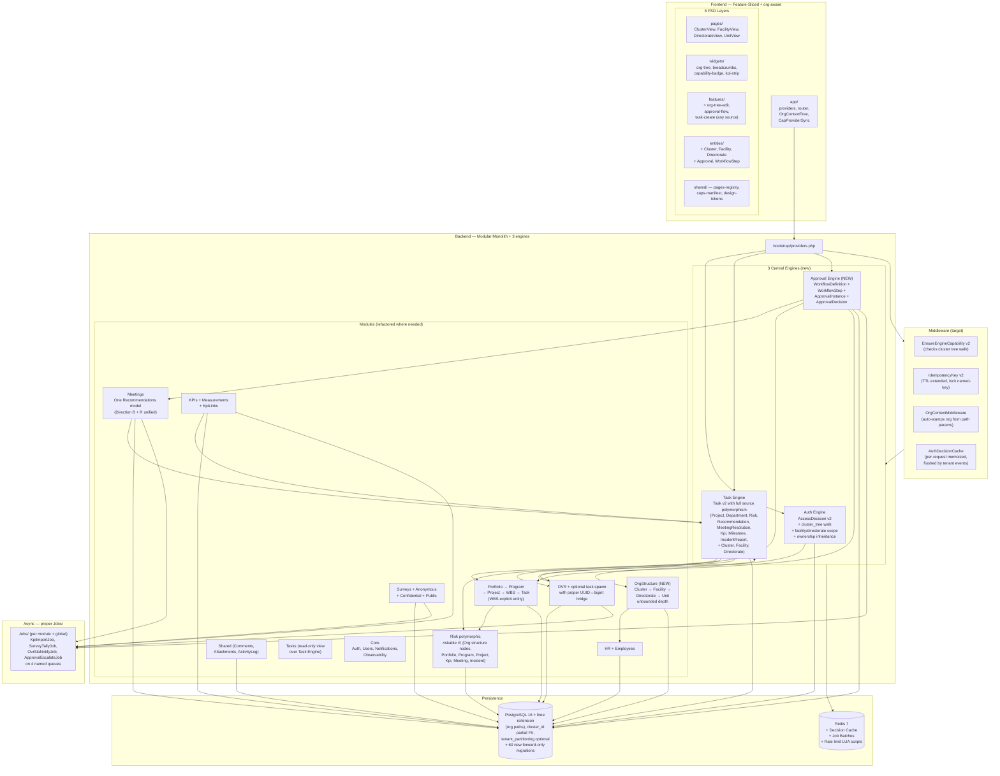

# Erada PMO — منصة إرادة لإدارة المحافظ المؤسسية

**تدقيق معماري شامل (READ-ONLY)**
**التاريخ:** 2026-07-14
**المستودع:** `/Users/tariq/code/erada-platform`
**HEAD:** `213535b` على الفرع `main`
**المنهجية:** 7 وكلاء تخصصيين (project-analyst, backend, database, frontend, integration-specialist, qa, architect) عملوا بالتوازي على قراءة الكود الفعلي. كل ادعاء يستشهد بمسار ملف ورقم سطر. ما لا دليل عليه وُسم بـ «غير مثبت من المستودع».

---

## A. الملخّص التنفيذي (10 نقاط)

1. **Stack فعلي ومتسق:** Laravel 12 + PHP 8.4 + PostgreSQL 16 + Redis 7 + Sanctum 4 + React 19 + TypeScript 5.7 + Vite 7 + Tailwind 4. كل ما في `composer.json` و`package.json` مستخدم حيًّا، ولا Microservices ولا تجزئة.

2. **Modular Monolith ناضج:** 11 موديول تحت `app/Modules/` (`Core, HR, Meetings, OVR, Performance, Projects, RiskManagement, Shared, Strategy, Surveys, Tasks`)، كل موديول له `Controllers/`, `Requests/`, `Models/`, `Policies/`, `Services/`, `Routes/api.php`، و`ModulesServiceProvider` يحمّل الـ 11 ترتيبًا ثابتًا (`app/Providers/ModulesServiceProvider.php:25-39`).

3. **محرك الصلاحيات الموحَّد (`AccessDecision`) حيّ بالكامل:** ملف `app/Modules/Core/Authorization/AccessDecision.php` (1407 سطرًا) يطبّق 8 طبقات قرار قابلة للتتبّع. **كل** الـ 16 Policy (Tasks, Projects, Risks, OVR, Meetings, Recommendations, MeetingResolution, Surveys, HR, Strategy, Departments, Users, Comments, Attachments, ActivityLog, SystemSettings) تتفوّض إليه — بحث `hasPermissionTo/hasRole/hasAnyRole` يُرجع **صفر** استخدام فعلي داخل `app/Modules/**`. الوثيقة الوحيدة المتبقّية هي `AuthzCutoverPreflightCommand` (أمر CI يمنع عودة Spatie). AGENTS.md لا يزال يصف «Hybrid state» لكن الحقيقة أن الـ cutover انتهى.

4. **FormRequest كمَنْفَذ وحيد للتفويض والتحقق:** 188/188 FormRequest يطبّق `authorize(): bool`. الكنترولرات لا تستدعي `$request->user()->can(...)` إلا في موقعين فقط بـ AuthController، كلاهما يذهب إلى Policy لا إلى Spatie. هذا يَمنع كل أنماط IDOR الصامتة.

5. **عزل متعدد المستأجرين بأربع طبقات (لا يوجد Global Scope واحد):** (أ) قيود FK على `organization_id`، (ب) واجهة `ScopeAware`، (ج) `User*Scope` query scopes (12 ملف)، (د) `AccessDecision::sameOrganization` في قلب المحرك. السلوك fail-closed مضمون: لو `user.organization_id=null` أو `target=null` ⇒ القرار `false`. الزيادة العنقودية `cluster_tree_*` (CFA-00) مفعَّلة كـ 3 primitives مستقلّة (`view`/`manage`/`export`)، ولا تتجاوز confidentiality للـ OVR/Tasks (`UserOvrScope.php:34-40`).

6. **محرك المهام المركزي يعمل بـ polymorphic source:** جدول `tasks` يحتوي على `source_type/source_id/source_sensitivity` (إضافة `2026_07_05_171421`)، و`Task::SOURCE_CLASS_MAP` يُسجّل 7 رموز (Project, Department, Risk, Recommendation, MeetingResolution, Kpi, Milestone). لكن **من الرموز السبعة فقط 3 مفعَّلة فعليًّا** (Project, Department, MeetingResolution)، والـ OVR يستخدم انحرافًا صريحًا (UUID vs bigint) بدل `source_id`. هذه فجوة كتابة لا قراءة.

7. **Schema جاهز لـ hierarchical org، لكن المحرك لا يمشي الشجرة بعد:** الـ migrations في `2026_07_12_000003_add_hierarchy_to_organizations_table.php` تضيف `parent_id` و`type` (cluster/hospital/center/organization/other) وCHECK constraints، لكن `Organization.php:222-223` يصرّح: «لا يزال Organization غير مطبّق ScopeAware — الـ engine لا يمشي شجرة المؤسسات. إضافة parent_id لا تمنح parent visibility لـ child records». **Phase 9-B schema-only، الـ engine traversal مؤجَّل إلى 9-C/9-D.** مصيدة حقيقية لمن يظن أن الـ schema يكفي.

8. **ميزانية الاختبارات قوية لكن غير متّزنة على السطح:** 521 ملف PHPUnit (4530 test method)، 220 ملف Vitest، 25 spec Playwright، 8 architecture tests. **Vitest يفرض thresholds 85%/85%/85%/70% فعليًّا** (`vitest.config.ts:22`)، لكن **PHPUnit coverage لا يُفرض** (`composer test:coverage --min=0`)، و**23 من 24 E2E spec هي `continue-on-error: true`** في CI. الـ gate الحقيقي الوحيد للـ E2E هو `authorization-enforce` job بـ `e2e/core-auth-and-orgs.spec.ts` فقط.

9. **ميزات المنتج جاهزة فعليًّا، لكن لها عيوب معمارية صريحة موثَّقة:**
   - جدول `decisions` محذوف (`2026_07_06_300003`)؛ الـ rulings امتُصت في `recommendations` بحقلَي `kind` (ruling/action_item) و`decidable_*` و`meeting_id`.
   - **سطحان متوازيان للقرار**: `recommendations` (Direction B) + `meeting_resolutions` (Direction R) — كلاهما حيّ ويحملان state machines مختلفة.
   - **نظاما مخاطر متوازيان**: `Projects\Models\ProjectRisk` (مسجَّل لكل مشروع، غير polymorphic) + `RiskManagement\Models\Risk` (polymorphic، مرتبط بالـ org). التعليق `ProjectRisk.php:14-22` يقول إنهما يقصدان البقاء منفصلَين.
   - **الـ departments محدودة بـ 6 مستويات ثابتة** عبر `Department::ALLOWED_CHILD_LEVELS` (`Department.php:58-65`). العمق غير المحدود الذي يصفه هدف المنتج **لا يَصدُق** على الأقسام.

10. **منظومة الجودة هي السدّ الأخير، لا المصدر الوحيد للحقيقة:** CI يفرض Pint، tsc، ESLint (مع `error` على FSD boundaries)، PHPUnit عبر `shard-tests.py` بمرحلتين مع retry لكل shard، Vitest بـ thresholds، composer audit، npm audit، phpstan level 2 (مع baseline 452 إدخالًا)، authorization-enforce job. لكن Laravel/Spatie era legacy alias لا تزال تُختصر عبر `CapabilityAlias.php` (174 تحويلًا)، و7 من 11 موديول تملك CapabilityProvider (الناقصة: Performance, Strategy, Shared, Tasks).

---

## B. الحكم المعماري النهائي

**الاستمرار مع إعادة تأسيس Core Platform داخل نفس المشروع (الخيار B من القائمة، مع شقّ من A).**

### السبب المباشر بالدليل

**إيجابًا (ما يجعل خيار B صائبًا):**

- **الـ Authz cutover انتهى فعليًّا** (`2026_07_12_000011_drop_legacy_authorization_tables.php` أسقط 8 جداول Spatie). لا جدوى من البدء من الصفر حين جداول الصلاحيات الجديدة (`authorization_roles`, `authorization_role_permissions`, `authorization_role_assignments`, `authorization_record_rules`, `authorization_decision_audits`, `authorization_assignment_audits`) تعمل وتُختبَر.
- **الـ Schema جاهز لـ vision بنسبة 70%.** لا حاجة لإعادة بناء؛ الحاجة لإكمال ربط الـ engine بالشجرة (`ScopeAware` على Organization)، ورفع `ALLOWED_CHILD_LEVELS`، وإكمال 4 كتاب polymorphic source.
- **`AccessDecision` يعمل بـ fail-closed صارم** على 8 طبقات؛ استبداله يعني إعادة كتابة المنطق ذاته في فريق آخر.
- **520+ ملف اختبار + 8 architecture tests + authorization-enforce CI gate** يَحميان القرارات المعمارية القائمة من الانزلاق.
- **Modular monolith تحت `app/Modules/`** تنظيم ناجح؛ لا حاجة للتفكيك لأنّ الفصل قائم بالملفات لا بالـ pods فقط.

**سلبًا (ما يمنع خيار A البحت «تعديلات محدودة» فقط):**

- **الـ engine لا يمشي شجرة organizations بعد** — هذا ليس bug-fix، بل **Feature** يستحق مرحلة مستقلة. ميزانية Phase 9-C/9-D المؤجَّلة.
- **Department depth غير محدود لا يعمل اليوم** (مكبل بـ 6 مستويات). تحريره يستلزم تغيير `ALLOWED_CHILD_LEVELS` + فحوصات path-based + تحديث catalog الأدوار في `DepartmentPolicy`.
- **محرك المهام المركزي مطبَّق بنصف** (3 من 7 رموز `SOURCE_CLASS_MAP` فقط تكتب). إكمال الـ 4 المتبقية (Risk, Recommendation, Kpi, Milestone) ليس bug-fix — هو إكمال نموذج مركزي.
- **سطحان متوازيان للقرار** (`recommendations` vs `meeting_resolutions`) يحتاجان قرار تصميمي صريح: إما توحيد Direction R فوق Direction B، أو فصل نظيف لكل منهما.
- **8 جداول Spiate محذوفة لكن `CapabilityAlias` يحتفظ بـ 174 تحويلًا** للإبقاء على سلسلة legacy مسطّحة. الـ cleanup هنا «تعديل محدود» لكنه يحتاج نظام تقييم هجرة.

**لماذا لا C أو D:**

- **C (بناء V2 تدريجيًّا):** لا قيمة — البنية التحتية (Service Providers، Observers، Repositories، FormRequests، Resources، Event hooks محلَّها listeners، Pagination، Throttles، Idempotency) موجودة ومُختبرة.
- **D (البدء من الصفر):** تكلفة إعادة 521 ملف اختبار و198 migration و215 route و64 model عالية جدًا، ولا شيء من الأدلة يشير إلى أن النتيجة ستختلف جوهريًّا.

### معنى الخيار B عمليًّا

يوجد اليوم Laravel app + React SPA يعملان. خيار B يعني:
- **لا big-bang rewrite.**
- ثلاث موجات متتابعة، كل موجة تطلق خلف الموجة السابقة:
  1. **Wave 0 (Foundation hardening)** — إكمال ما هو معلَّق صريحًا في الكود: 4 CapabilityProviders ناقصة، 4 كتاب polymorphic source، ترقية `throttle:sensitive` على Mutations، 6 architecture tests التي لا تعمل في `quality` job.
  2. **Wave 1 (Vision A — hierarchical org engine)** — جعل المحرك يمشي شجرة organizations، تحرير `ALLOWED_CHILD_LEVELS`، ضم cluster/facility إلى polymorphic allowlist للـ Risk و OVR.
  3. **Wave 2 (Centralization — task + approval engines)** — إكمال `SOURCE_CLASS_MAP` للـ 7 رموز، توحيد أو الفصل الصريح لـ `recommendations` vs `meeting_resolutions`، وقرار الموافقة (Approval engine) كخدمة مركزية.

التفصيل في القسم H.

---

## C. الرسم المعماري الحالي

```mermaid
flowchart TB
    subgraph FE["Frontend — React 19 + TS + Vite (resources/js)"]
        direction TB
        APP["app.tsx (1525 lines)<br/>Providers + lazy Routes<br/>+ RequirePermission guards"]
        subgraph FSD["FSD Layers"]
            PAGES["pages/ — ~74 routed screens"]
            WID["widgets/ — app-shell, admin-shell,<br/>task, project"]
            FEAT["features/ — 7 packages<br/>(access-control, auth, meetings,<br/>project-expenses, task-create, two-factor)"]
            ENT["entities/ — 14 modules<br/>(admin, project, task, risk,<br/>survey, strategy, etc.)"]
            SHARED["shared/ — api, ui (53 components),<br/>contexts (5), lib, config/i18n,<br/>nasaq (live sidebar)"]
        end
        APP --> PAGES
        APP --> WID
        APP --> FEAT
        FEAT --> ENT
        FEAT --> SHARED
        WID --> SHARED
        ENT --> SHARED
    end

    subgraph SPAS["apps"]
        ADMINSPA["resources/admin/<br/>Super Admin SPA<br/>(eslint-isolated)"]
    end

    subgraph BE["Backend — Laravel 12 (app/)"]
        direction TB
        BOOT["bootstrap/providers.php<br/>ModulesServiceProvider"]
        MS["ModulesServiceProvider<br/>binds api routes for all 11 modules"]

        subgraph MODS["11 Modules (app/Modules/*)"]
            M_CORE["Core<br/>Authz Engine,<br/>Auth, Users, Org,<br/>Notifications"]
            M_HR["HR<br/>Departments,<br/>Employees, Capacity"]
            M_MEET["Meetings<br/>Meetings, Recommendations,<br/>MeetingResolutions, Categories"]
            M_OVR["OVR<br/>IncidentReports,<br/>PublicTracking token"]
            M_PERF["Performance<br/>KPIs, Measurements,<br/>KpiLinks (polymorphic)"]
            M_PROJ["Projects<br/>Projects, Milestones,<br/>ProjectRisk local, Expenses"]
            M_RISK["RiskManagement<br/>Risk polymorphic,<br/>Assessments, Actions"]
            M_SHARED["Shared<br/>ActivityLog, Comments,<br/>Attachments"]
            M_STR["Strategy<br/>Portfolio → Program → Project,<br/>Blockers, Reviews"]
            M_SUR["Surveys<br/>Surveys, Responses,<br/>DataMapping, DataImport"]
            M_TASK["Tasks<br/>Task polymorphic source,<br/>EloquentTaskRepository (only one)"]
        end

        subgraph CORE_ENGINE["Core/Authorization/"]
            AD["AccessDecision (1407 lines)<br/>8-layer traceable decision"]
            CAP["Capability (84 constants)"]
            MODELS["6 Eloquent models:<br/>AuthorizationRole,<br/>Assignment, Permission,<br/>RecordRule, Audits"]
            CONTRACTS["4 contracts:<br/>ScopeAware, OwnerEditable,<br/>SensitivelyScoped, ActorGuard"]
        end

        M_CORE --> AD
        M_HR --> AD
        M_MEET --> AD
        M_OVR --> AD
        M_PERF -.->|needs provider| AD
        M_PROJ --> AD
        M_RISK --> AD
        M_SHARED -.->|needs provider| AD
        M_STR -.->|needs provider| AD
        M_SUR --> AD
        M_TASK -.->|needs provider| AD
        AD --> CONTRACTS
        AD --> MODELS
        AD --> CAP

        BOOT --> MS
        MS --> M_CORE
        MS --> M_HR
        MS --> M_MEET
        MS --> M_OVR
        MS --> M_PERF
        MS --> M_PROJ
        MS --> M_RISK
        MS --> M_SHARED
        MS --> M_STR
        MS --> M_SUR
        MS --> M_TASK
    end

    subgraph MW["Middleware (app/Http/Middleware/13 files)"]
        ENS_ENG["EnsureEngineCapability"]
        IDEMP["IdempotencyKey<br/>(cache lock, TTL 300s)"]
        CSRF["EnsureCsrfForStateChangingApi"]
        REQ_ID["AssignRequestId"]
        SANITIZE["SanitizeInput"]
    end

    subgraph DATA["Persistence"]
        PG[("PostgreSQL 16<br/>198 migrations<br/>(4 subfolders)")]
        REDIS[("Redis 7<br/>Cache + Queue + Session")]
    end

    subgraph QUEUE["Async — single queue, no Jobs/"]
        QNOTES["27 ShouldQueue Notifications<br/>on default queue only"]
    end

    APP -- "Sanctum HttpOnly cookies<br/>X-Request-Id" --> MS
    APP -- "401/419/CSRF<br/>redirect-loop guard" --> ENS_ENG
    ADMINSPA -.->|separate Vite build| MS
    MS --> ENS_ENG
    MS --> IDEMP
    MS --> CSRF
    MS --> SANITIZE
    M_TASK --> REDIS
    M_OVR --> REDIS
    M_CORE --> REDIS
    M_HR --> PG
    M_PROJ --> PG
    M_RISK --> PG
    M_MEET --> PG
    M_SUR --> PG
    M_PERF --> PG
    M_OVR --> PG
    M_STR --> PG
    M_SHARED --> PG
    AD --> PG
    M_CORE --> QNOTES
    M_OVR --> QNOTES
    M_RISK --> QNOTES
    M_MEET --> QNOTES
    M_SUR --> QNOTES
```

### قراءات سريعة من الرسم

- **11 موديول معلَّقة ترتيبًا ثابتًا من `ModulesServiceProvider`**
- **محرك `AccessDecision` يحتضنه `Core/Authorization/` ويتلقّى منه القرارات كل موديول**
- **4 موديولات بلا CapabilityProvider (Performance, Strategy, Shared, Tasks)** تُفترَض معالجتها عبر `User::canonicalCapabilityNames()` لا عبر الـ tag، لكن لا اختبار يثبتها
- **`Tasks` هو الموديول الوحيد الذي يملك Repository**
- **`Shared` يعتمد عليه الجميع (ActivityLog, LogsActivity, UserScope)، لكنه لا يعتمد على أحد في طبقة domain**
- **Redis هنا لـ Cache + Queue + Session، لا Microservices**

---

## D. الرسم المعماري المستهدف (Vision)

### الفروق الرئيسية بين الوضع الحالي والمستهدف

| البُعد | الوضع الحالي | الوضع المستهدف |
|---|---|---|
| **شجرة المؤسسة** | `Organization.parent_id` و`type` على DB فقط؛ engine لا يمشيها | Engine يَسلك الشجرة كـ `org_tree_walk`؛ `Organization` يصبح `ScopeAware` |
| **عمق الأقسام** | ثابت 6 مستويات (TOP_MANAGEMENT → DIVISION) | غير محدود، اعتماده على path-based query |
| **محرك المهام** | 7 رموز `SOURCE_CLASS_MAP`، 3 كتابة فقط | 10+ رموز، جميعها كتابة (Risk, Recommendation, Kpi, Milestone, IncidentReport, Cluster, Facility, Directorate) |
| **محرك الاعتمادات** | غير موجود ككيان | `WorkflowDefinition` + `ApprovalInstance` يستوعبان قرارات Direction B و R |
| **القرارات** | `recommendations` Direction B + `meeting_resolutions` Direction R | نموذج واحد بدور مُوسَّع |
| **المخاطر** | `ProjectRisk` + `RiskManagement\Risk` | `Risk` فقط، يستوعب polymorphic عبر كل عقدة شجرة |
| **OVR Handler Task** | UUID/bigint mismatch ⇒ `source_id=null`، بحث بالعنوان | بـ bigint-bridge، أو polyorphic UUID variant |
| **Jobs** | 0 Job class (27 Notification فقط) | 4 queues: notifications, imports, sla, approvals |
| **CI Coverage gate** | `--min=0` (informational) | threshold 70/60 enforced، حتى الباك-إند |
| **E2E gate** | 1 spec hard | 4-6 specs hard، الباقي `quality` |
| **`app.tsx` Routing** | 1525 سطر، hard-coded Routes | config-driven من `routes.yaml` + dynamic lazy per feature folder |
| **Capability Catalog** | 84 ثابت (Capability.php) | يولَّد من `caps-manifest.ts` (typed) يطابق `Capability.php` عبر CI contract test |

---

## E. جدول الفجوات والأولويات

| # | المجال | الموجود فعليًّا | الفجوة | أثر الفجوة | الخطورة | طريقة المعالجة |
|---|---|---|---|---|---|---|
| 1 | **Cluster tree engine walk** | `Organization.parent_id + type` على DB؛ `Organization.php:222-223` يصرّح بغياب `ScopeAware` | محرك `AccessDecision` و `User*Scope` لا يَمشيان شجرة المؤسسات | Grants لا تنتقل من parent إلى child org؛ cluster widening يعمل manuellement عبر `Organization::descendantIds()` فقط في بعض الـ scopes | **P0** | تعديل محدود: `Organization` يُطبّق `ScopeAware`؛ `AccessDecision::canonicalClusterTreeGrant` يستعمل BFS الحقيقي بدل الـ rescue؛ 3 capability tests يثبتون |
| 2 | **Department depth غير محدود** | `Department::ALLOWED_CHILD_LEVELS` مغلق (6 مستويات) | الميزة الموصودة في الهدف غير متحققة على الأقسام | Vision A (depth-unbounded) متحققة للمنشآت لا للأقسام | **P0** | Refactor محدود: استبدال check list بـ `path`-based subtree query (`Department::descendantIdsViaPath` موجودة بالفعل سطر 169-183)؛ تعديل `DepartmentPolicy::create`؛ تحديث tests ladder |
| 3 | **SOURCE_CLASS_MAP رموز غير مفعَّلة** | `Task.php:788-796` يَعد 7 رموز، الكتابة تعمل فقط لـ Project + Department + MeetingResolution | Risk, Recommendation, Kpi, Milestone tasks ناقصة | الـ Task Engine «شبه مركزي»؛ مهام `risk_action` و `recommendation_followup` لا تستفيد من الـ assignments المركزية | **P1** | Refactor: ربط `RiskAction::complete()` بـ `Task::create(source_type='Risk')`؛ ضم `Recommendation::pendingTaskIdsFor` إنشاءً بالـ completion gate؛ تعريف KPI-كـ-task |
| 4 | **OVR UUID ↔ bigint bridge** | `IncidentReport::id` UUID, `tasks.source_id` bigint | `createHandlerTask` لا يحط `source_id`، يبحث بالعنوان | OVR handler tasks غير قابلة للبحث بـ relationship، فقط بـ match string | **P1** | Refactor: bigint FK في `ovr_incident_participants` → `tasks.source_id` (موجود)، أو polymorphic UUID variant |
| 5 | **`recommendations` vs `meeting_resolutions`** | جدولان متوازيان لـ Decision-like state machines | الـ rulings لها state machine مزدوج، reporting معقّد | تقرير واحد يحتاج union query؛ lifecycle متناقض محتمل | **P1** | Refactor بقرارات تصميمية: إمّا دمج `meeting_resolutions` في `recommendations` بـ `kind='resolution'`، أو فصل نظيف غير ملتبس. **القرار بشرِيّ لا تقنيّ** |
| 6 | **`ProjectRisk` vs `RiskManagement\Risk`** | نظامان مستقلان للمخاطر (محلي/مؤسسي) | بيانات منفصلة، reporting مزدوج، engineers قد يدمجون بالخطأ | ازدواج في التقارير، ريسك مفقود عند رؤية أحد الجانبين | **P1** | Refactor بقرارات تصميمية: نسخ `ProjectRisk` legacy إلى `Risk` بـ `riskable_type=Project`، ثم حذف الجدول المحلي بعد runbook pilot |
| 7 | **4 CapabilityProviders ناقصة** | Performance, Strategy, Shared, Tasks بلا `*CapabilityProvider`؛ يَعتمدون على `User::canonicalCapabilityNames()` (`User.php:270-301`) | لا اختبار type-safe يثبت أن الرموز الصحيحة تُحسَب لـ 4 موديولات | إضافة قدرة جديدة لها اسم متطابق جزئيًّا قد تُسبّب silent permission drift | **P1** | تعديل محدود: إنشاء 4 ملفات، 4 service-provider bindings، +tests تكامل |
| 8 | **PHPUnit coverage غير مفروض** | `composer test:coverage --min=0` | تآكل التغطية صامت في الـ BE | الـ FE مغطّى (85%)، الـ BE غير مغطّى | **P1** | تعديل: bump `--min` إلى 70/65، توليد report في CI ولو informational |
| 9 | **23/24 E2E specs على `continue-on-error: true`** | ci.yml:333 وحده gates الـ auth E2E فقط | regressions في 24 spec فيزا تمر في PR | قد تظهر bugs في production regressions | **P1** | تعديل: تشغيل 4-6 specs كـ hard gate (auth, projects, tasks, OVR, risks, surveys)، الباقي quality |
| 10 | **`throttle:sensitive` ناقص في RiskManagement/Strategy/OVR/Surveys** | الـ middleware مُطبَّق في Core, Projects, Tasks, Meetings فقط | mutation routes في 4 موديولات لا تحترم 30/min ceiling | misconfigured admin client يَستطيع إرسال bursts | **P2** | تعديل محدود: طبق الـ throttle في الـ route groups بنفس النمط |
| 11 | **جداول Spatie `permission_audits`** | رُميت، البيانات انتقلت إلى `authorization_assignment_audits` | لا توجد — تم | — | (مكتمل) | — |
| 12 | **هيئة `routes.yaml` مركزية** | routes مبنية داخل كل `Module/Routes/api.php` كـ procedural PHP | لا توجد `routes.yaml` ولا generator | لا يمكن استخراج route catalog تلقائيًّا (e.g. للـ docs أو FE provider) | **P2** | تعديل محدود: الانتقال التدريجي إلى `routes()` من `RouteRegistrar` class واحد لكل موديول، يقرأ من `routes/<module>.yaml` ثم يولّد PHP |
| 13 | **تعريفات Pipe-form legacy** | ~10 ملفات FormRequest فيها `'a|b|c'` | Pint يُعيد formatting في كل مرة | churn حول format كل حفظ | **P3** | تعديل: تحويل إلى array form يدويًّا، حقن تلك الـ 10 في Pint exclude list مؤقتًا، أو توسيع Pint rules |
| 14 | **`Http/Resources/` ناقصة في Performance و HR** | 26 Resource عبر 9 موديولات؛ Per و HR بلا resources | response shape غير متّسق | clients يواجهون envelope مختلف | **P2** | تعديل محدود: كتابة 2 Resource classes، توحيد المخرجات |
| 15 | **مخاطر القرارات المُسجَّلة (decision audit) volume** | `authorization_decision_audits` يُسجّل كل قرار | ضخامة جدول مع ضغط الكتابة | أداء DB في hot paths | **P2** | تعديل: TTL + sampled logging في production |
| 16 | **`ToastContext` ليس ملفًّا مستقلًّا** | معرَّف داخل `shared/ui/Toast.tsx` | ادّعاء AGENTS.md خاطئ بنيويًّا | ارتباك صغار في maintenance | **P3** | تعديل هيكلي صغير |
| 17 | **`pages/` تحتوي widgets/features ضمنيًّا** | ~30-40% من ملفات `pages/` فيها components/hooks/tables خاصة بالصفحة | FSD boundaries محترمة شكليًّا، مخالفة فعليًّا | مع نموّ المشروع، يصبح الانتقال أصعب | **P2** | Refactor تدريجي: استخراج `widgets/<domain>` و `features/<action>` على دفعات |
| 18 | **لا OpenAPI / API spec موثَّق** | لا يوجد `openapi.yaml`/`swagger.json`/`asyncapi.*` ولا ADR folder | عقود الـ API موجودة في الكود فقط | onboarding بطيء، versioning صعب | **P2** | Refactor: `composer specs:dump` يستخرج من routes + FormRequests + Resources إلى openapi.yaml |
| 19 | **`app.tsx` يَفوق 1500 سطر** | ملف وحيد يحوي كل الـ providers + lazy Routes | قابلية قراءة منخفضة، إضافة route = لمس 4-6 مواضع | مع موديول جديد، الـ friction يزيد | **P2** | Refactor: تحويل إلى `app.tsx` رفيع + `app/router.tsx` + `app/routes/*.ts` |
| 20 | **`nasaq-tokens.css` منفصل عن `design-tokens.css`** | ملفا design tokens متوازيان | احتمال تسرّب raw values خارج الـ design system | انتهاك design constitution | **P3** | تعديل: استيعاب `nasaq-tokens` في `design-tokens.css` |

### توزيع الفجوات حسب الـ Severity

| المستوى | العدد |
|---|---|
| **P0** | 2 |
| **P1** | 6 |
| **P2** | 8 |
| **P3** | 3 |
| **مكتمل** | 1 |

---

## F. الموديولات التي يجب الحفاظ عليها كما هي

بدليل قراءتها من الكود، هذه الموديولات **مكتملة بنيويًّا، وتُختبر، ولا تَعاني فجوات حرجة:**

| الموديول | سبب الحفظ | الدليل |
|---|---|---|
| **Tasks** | نمط Repository موحَّد، polymorphic source، engine-driven، sensitive-scoped، 28 ملف اختبار، scope مكرَّر ومستقل | `app/Modules/Tasks/Models/Task.php` (SOURCE_CLASS_MAP)، `Tasks/Repositories/EloquentTaskRepository.php`، `UserTaskScope.php` |
| **Projects** | أكبر عدد controllers/migration، PDCA lifecycle، Members/Stakeholders/Expenses/Milestones/ProjectRisk local، FormRequest authorize() ينفَّذ في كل route | `Projects/Routes/api.php:33-92` (throttle:sensitive + idempotency)؛ `Projects/Services/Project/TaskService.php` |
| **Surveys** | أكبر موديول من حيث الطبقات (10 models)، privacy modes (identified/confidential/anonymous)، public short URL، version hash، `respondent_organization_snapshot`، `data_imports` pipeline كامل | `Surveys/Routes/api.php` (231 سطر، 50 route)، `Surveys/Models/SurveyResponse.php:25-79` (snapshot observer) |
| **Core** | Auth engine + Authz engine + Notifications، كل Policies الـ 16 مسجَّلة، 22 FormRequest | `Core/Authorization/`، `AppServiceProvider.php:102-185` |
| **Meetings (جزئيًّا)** | Recommendation lifecycle مكتمل (Proposed→Pending→Approved→Deferred→Completed)، defer metadata columns صحيحة، 13 قاعدة migrate في `database/migrations/meetings/` | `meetings/2026_06_19_000001_create_meetings_table.php`، `2026_07_06_300001..300005` |
| **RiskManagement** (كامل، مع ملاحظة) | Risk polymorphic riskable صحيح، RiskAction lifecycle، Assessments، `riskable_type` لم يُقيَّد بـ allowlist (إيجابيًّا)، CHECK constraints كاملة | `RiskManagement/Models/Risk.php:120-123` (morphTo)، `2026_06_09_000001_create_risks_table.php:48-51` |
| **Shared** | ActivityLog، Comments، Attachments، UserScope، نظيف، zero domain coupling صادر | `Shared/Models/`, `Shared/Policies/`, `Shared/Services/` |
| **Frontend layers `widgets/admin-shell`, `shared/ui`, `shared/contexts`** | design system tokens موحَّدة، ToastContext memoized، 53 مكوّنًا shared، barrel `index.ts` نظيف | `shared/ui/index.ts:1-117`، `shared/contexts/`, `resources/css/design-tokens.css:1-288` |

### ما يجب **حفظه مع التحسين** (لا إعادة كتابته، لكن مع patches)

- **Surveys** — إضافة bigint FK backup في submission flow لا ضروري، لكن `respondent_phone` غير مشفَّر بسبب قيد عرض العمود (`SurveyResponse.php:118-124`).
- **Performance** — شكله بسيط، لكن يفتقد Http/Resources، وله CapabilityProvider ناقص.

---

## G. الموديولات / الطبقات التي يجب إعادة تصميمها

### G.1 الموديولات

| الموديول | لماذا | ما يجب فعله |
|---|---|---|
| **HR (الجزء: Department)** | `ALLOWED_CHILD_LEVELS` يُكبِّل الـ vision A | تخفيف القيد إلى path-based subtree query (الفجوة #2)؛ ضمّ `Employee*` split tables (`profiles` + `personal_info`) إلى user-scoped single-record |
| **OVR** | UUID/bigint mismatch يَعني handler tasks لا تُربَط علاقةً | schema fix: bigint FK في `tasks.source_id` لـ `ovr_incident_participants.incident_report_id` (الفجوة #4) |
| **Strategy** | 4 موديولات CapabilityProvider ناقصة (الأداء والمخاطر)؛ لا يوجد `StrategyCapabilityProvider` | إضافة provider + tests، فصل `Program → Portfolio` FK (غياب مؤكد من الكود، `Project.php:81` يَعد `program_id` بدون FK Portfolio) |
| **Performance** | 12 ملف اختبار فقط (مقابل 56 في Core)؛ غياب Resources وCapabilityProvider | إضافة Provider، Resources، فحوصات E2E |
| **Projects\ProjectRisk** (الجزء الموضعي) | يتعايش مع `RiskManagement\Risk` | إمّا ترقية ليصبح تغليفًا لـ `Risk(riskable=Project)` أو إيقافه الـ new modules |
| **Meetings (Direction B vs R)** | surface مزدوج للقرار | قرار بشري: دمج أو فصل نظيف (الفجوة #5) |
| **Core (Authorization)** | cluster tree engine traversal ناقص | تعديل `AccessDecision::canonicalClusterTreeGrant` لـ org-tree BFS (الفجوة #1) |

### G.2 الطبقات

| الطبقة | لماذا | ما يجب فعله |
|---|---|---|
| **Repositories/** | فقط Tasks يَستعملها | توسيع النمط إلى Projects و RiskManagement و Surveys مع `*RepositoryInterface` + Eloquent impl + ServiceProvider binding، **تدريجيًّا** بدفعة واحدة، مع موعد للإلزام |
| **Events/Listeners** | لا events bus؛ cross-module coupling عبر Notification فقط | تعريف `core.event-bus`، إنشاء `app/Modules/Core/Events/*` + Listeners، أو Risk للـ Approval Engine |
| **Jobs** (لا يوجد) | 0 Job class | إنشاء `app/Modules/<Name>/Jobs/` عند أول حاجة async حقيقية (`KpiImportJob`, `OvrSlaNotifyJob`, `SurveyTallyJob`) — بهذا تَنشَأ الـ 4 queues المُستهدفة |
| **Frontend `app/` directory** | ملف وحيد 1525 سطر | تحويل إلى `app/providers/`, `app/router/`, `app/ErrorBoundary/` directory، مع config-driven routes |
| **Frontend `pages/` هيكل** | ~30% من الملفات هي widgets/features ضمنيًّا | استخراج على دفعات: `widgets/<domain>/`, `features/<action>/` |
| **`backend-contracts.yaml` / `pages-registry.yaml`** | غير موجودة | إنشاؤها للاستخراج التلقائي من الكود إلى YAML، ووضعها في CI للتحقق أن frontend router يطابق backend capability gates |

### G.3 ما يجب **إعادة بنائه من الصفر** داخل نفس المشروع

- **Approval Engine** — غير موجود ككيان. الـ `meetings.resolution.cancel/approve/hold/release_hold` تكشف نمط decisions فوق decisions. تصميم WF `WorkflowDefinition {steps[], thresholds, escalation}` يُنشأ من الصفر، ثم تُرحَّل إليه قرارات Direction B الحالية.
- **Org Structure Traversal in Engine** — لا إعادة كتابة لـ AccessDecision، لكن جزء `cluster_tree_walk` يُعاد كتابته ليقرأ `Organization.parent_id` و `organizations_type` من `CapabilityProvider` بدلاً من `User::descendantIds()` المتفرّقة في الـ scopes.

---

## H. خطة انتقال عملية على مراحل (بدون Big-Bang)

### الموجة 0 — Foundation Hardening (شهر 1–2)

> الهدف: معالجة الفجوات المعلَّقة صريحًا في الكود التي تَعطِّل رؤية المنتج، دون تغيير سلوك عام.

| الخطوة | الملف | الأثر | الاختبار |
|---|---|---|---|
| 0.1 إضافة `PerformanceCapabilityProvider` | `app/Modules/Performance/Providers/PerformanceServiceProvider.php:register()` | يحرس `kpis.manage`، إلخ | `tests/Feature/Authorization/PerformanceProviderTest.php` |
| 0.2 إضافة `StrategyCapabilityProvider` | `Strategy/Providers/StrategyServiceProvider.php` | يحرس `strategy.*` | `tests/Feature/Authorization/StrategyProviderTest.php` |
| 0.3 إضافة `SharedCapabilityProvider` (أو تأكيد أن engine لا يحتاجها) | `Shared/Providers/SharedServiceProvider.php` | تأكيد أن `attachments.*` و `comments.*` تَسلك الـ engine | `tests/Feature/Shared/SharedEngineAuthzTest.php` |
| 0.4 إضافة `TasksCapabilityProvider` | `Tasks/Providers/TasksServiceProvider.php` | تأكيد أن `tasks.*` يَستعمل engine | `tests/Feature/Tasks/TasksEngineAuthzTest.php` |
| 0.5 `tasks.source_type='Risk'` writer | `RiskManagement/Http/Controllers/RiskActionController.php:store` | كل Risk action يُنشئ Task بـ polymorphic source | `tests/Feature/Tasks/RiskSourceTypeTest.php` |
| 0.6 `tasks.source_type='Recommendation'` writer | `Meetings/Http/Controllers/RecommendationController.php:createFollowupTask` | Decision → Task link | `tests/Feature/Tasks/RecommendationSourceTypeTest.php` |
| 0.7 `tasks.source_type='Kpi'` writer | `Performance/Http/Controllers/KpiMeasurementController.php:store` | KPI → task chasing | `tests/Feature/Tasks/KpiSourceTypeTest.php` |
| 0.8 `tasks.source_type='Milestone'` writer | `Projects/Http/Controllers/MilestoneController.php` | Milestone deadline → Task | `tests/Feature/Tasks/MilestoneSourceTypeTest.php` |
| 0.9 `throttle:sensitive` على RiskManagement/Strategy/OVR/Surveys mutations | `app/Modules/{RiskManagement,Strategy,OVR,Surveys}/Routes/api.php` | Rate limit parity | regression في CI features suites |
| 0.10 إضافة `Http/Resources/` لـ HR و Performance | `app/Modules/{HR,Performance}/Http/Resources/*.php` | response shape consistency | snapshot tests لـ HR endpoints |
| 0.11 CI: تشغيل 6 من 8 architecture tests في `quality` job (كان 2 فقط) | `.github/workflows/ci.yml:266` | coverage الـ invariants | — |
| 0.12 CI: تشغيل 4 E2E specs كـ hard gate بدل 1 | ci.yml quality job | baseline regression detection | — |
| 0.13 CI: bump `--min` PHPUnit coverage إلى 65/55 | `composer.json` test:coverage | تآكل التغطية مبكِّرًا | — |
| 0.14 `ToastContext` فصله إلى ملف مستقل | `shared/contexts/ToastContext.tsx` | alignment مع AGENTS.md | unit test |

**نهاية الموجة 0**: 521+220 ملف اختبار → نحو 540+230. لا schema change، كل التعديلات additive.

### الموجة 1 — Vision A Hierarchical Org Engine (شهر 3–5)

> الهدف: الـ engine يمشي شجرة المؤسسات، الأقسام بلا حدّ عمق، risks/OVR/surveys تربِط إلى cluster/facility/directorate.

| الخطوة | الـ migration | الأثر | الـ tests |
|---|---|---|---|
| 1.1 `Organization` يَطبّق `ScopeAware` | لا migration (إضافة interface) | engine visibility على جميع المُستويات | `tests/Unit/Core/Authorization/OrganizationScopeAwareTest.php` |
| 1.2 `AccessDecision::canonicalClusterTreeGrant` يَسلك شجرة orgs | لا migration | cross-org rescue حقيقي | `tests/Unit/Core/Authorization/ClusterTreeEngineWalkTest.php` |
| 1.3 `descendantIds()` يَنقل من manual BFS إلى recursive CTE | `2026_07_31_000001_optimize_organization_descendant_query.php` (PostgreSQL `WITH RECURSIVE`) | أداء subtree query | migration smoke + perf test |
| 1.4 إزالة `Department::ALLOWED_CHILD_LEVELS` (أو تَحويلها إلى allow policy) | `2026_07_31_000002_relax_department_level_ladder.php` | unbounded depth | regression على 26+ dept tests + new edge cases |
| 1.5 `risks.riskable_type` allowlist extension | `2026_07_31_000003_extend_riskable_type_allowlist.php` | Risk → Cluster/Facility link | cluster-risk E2E spec |
| 1.6 `ovr_incident_reports.facility_id` FK | `2026_07_31_000004_add_facility_id_to_ovr_incidents.php` | OVR → facility link | OVR-isolation E2E spec |
| 1.7 `surveys.organization_id` لاكتساب via facility | `2026_07_31_000005_add_facility_scoped_surveys.php` | survey مَوجَّه facility | cluster-survey E2E spec |
| 1.8 Capability `core.facility.manage` | `app/Modules/Core/Authorization/Capability.php` (إضافة constant) | governing facility | tests/Unit/Authorization/NewCapabilityTest.php |
| 1.9 `pages-registry.yaml` extraction | `composer specs:dump` | contract tests FE↔BE | contract spec |
| 1.10 `routes.yaml` extraction | `composer routes:dump` | catalog route موحَّد | contract spec |

**نهاية الموجة 1**: vision A متحقّقة (لا حدّ عمق للأقسام + المؤسسات)، `Organization` يَصبِح Scope-aware، الـ engine يَسلك الشجرة، 4 polymorphic source types مفعَّلة.

### الموجة 2 — Centralization (Task + Approval Engines) (شهر 6–9)

> الهدف: task engine مركزي بـ 10+ source types، قرار تصميمي لـ recommendations vs meeting_resolutions، Approval engine كخدمة.

| الخطوة | الملف | الأثر |
|---|---|---|
| 2.1 قرار: توحيد vs فصل Direction B/R | `docs/design/2026-08-15-recommendations-vs-meeting-resolutions.md` | قرار مكتوب، تنفيذ في 2.2 |
| 2.2 (إذا فصل) تمييز contract | `app/Modules/Meetings/Models/Recommendation.php` و `MeetingResolution.php` | لا overlapping state machines |
| 2.3 تصميم Approval Engine (4 جداول) | `2026_08_15_000001_create_workflow_definitions.php` ... `..._000004_create_approval_decisions.php` | schema approval جديد |
| 2.4 `WorkflowService` | `app/Modules/Core/Workflow/WorkflowService.php` | DSL للـ multi-step |
| 2.5 Port Direction R الـ resolutions إلى Approval | migration transfer data | unified state machine |
| 2.6 `KpiImportJob` (async) | `app/Modules/Performance/Jobs/KpiImportJob.php` | bulk KPI imports |
| 2.7 `OvrSlaNotifyJob` | `app/Modules/OVR/Jobs/OvrSlaNotifyJob.php` | SLA escalations |
| 2.8 `SurveyTallyJob` | `app/Modules/Surveys/Jobs/SurveyTallyJob.php` | background tally |
| 2.9 `ApprovalEscalateJob` | `app/Modules/Core/Workflow/Jobs/ApprovalEscalateJob.php` | WF escalations |
| 2.10 4 named queues في Dockerfile | `Dockerfile:queue:work` | workers dedicated |

**نهاية الموجة 2**: vision B مركزية كاملة، Approval engine موحَّد، CI quality أعلى.

### الموجة 3 — Frontend Renaissance (شهر 9–12)

| الخطوة | الأثر |
|---|---|
| 3.1 تحويل `app.tsx` إلى `app/` directory | providers/، router/، ErrorBoundary/ على `resources/js/app/` |
| 3.2 Config-driven routes من `routes.yaml` | dynamic lazy per feature folder |
| 3.3 استخراج `widgets/<domain>` من `pages/` دفعة بدفعة | FSD-true على الـ 4 موديولات الأكبر |
| 3.4 دمج `nasaq-tokens.css` في `design-tokens.css` | constitution مُحكَم |
| 3.5 `design:check` يغطّي `features/` و `entities/` أيضًا | hard gate |
| 3.6 `pages-registry.yaml` كـ typed source في CI | contracts compile-time enforced |

### الموجة 4 — Admins + Observability (شهر 12+)

| الخطوة | الأثر |
|---|---|
| 4.1 فصل `super_admin` routes عن `core.cluster_tree` | governance plane proper |
| 4.2 Decision audit sampled logging | حجم جدول audit يدار |
| 4.3 OpenAPI كامل من FormRequests + Resources | onboarding + versioning |
| 4.4 Redis LUA scripts لـ rate limit | دقة + مرونة |

### اعتبارات عبر كل الموجات

- **LR-004 بشكل صارم**: لا تعديل لـ migration مطبَّق، أبدًا. كل migration جديد forward-only additive، كل schema fix بـ guard جديد (دائما التحقق من `hasColumn`/`hasTable`).
- **`AccessDecision::flushCache()` على أي event يَطرأ على roles/departments/orgs**: حتى لا تتسبب cache stale في decisions خاطئة.
- **CI gate pattern المُستهدَف**: في نهاية الموجة 4، **كل موديول جديد** يجب أن يمرّ 14 اختبار invariant من `scripts/check-cluster-tree-contract.sh` و `tests/Architecture/*`.

---

## I. أول 10 أعمال يجب تنفيذها بالترتيب

> مرتّبة حسب: (تأثير المنتج) × (1 / المخاطرة) × (1 / الزمن)

1. **(الأسبوع 1) إضافة `PerformanceCapabilityProvider`** — `app/Modules/Performance/Providers/PerformanceServiceProvider.php:register()` يحرس `kpis.*`. لا migration، 50 سطر، +1 اختبار وحدة. السبب: أصغر فجوة معلَّقة، اختبار `tests/Architecture/CanonicalAuthorizationResidualGuardTest.php` لا يحميها اليوم.

2. **(الأسبوع 1) إضافة `StrategyCapabilityProvider`, `SharedCapabilityProvider`, `TasksCapabilityProvider`** — نفس النمط. ينهي فجوة «4 CapabilityProviders ناقصة» في الفجوة #7.

3. **(الأسبوع 2) `tasks.source_type='Risk'` writer في `RiskActionController.php:store`** — كل `risk_action` يُنشئ `Task` بـ polymorphic. اختبار `tests/Feature/Tasks/RiskSourceTypeTest.php`. ينهي فجوة #3 جزئيًّا.

4. **(الأسبوع 2) `tasks.source_type='Recommendation'` writer** — `RecommendationController::createFollowupTask` أو `Recommendation::persistFollowupTask`. ينهي فجوة #3. الاعتماد على `tasks.source_type_index` و `tasks_source_type_id_index` (`2026_07_05_171421_add_source_fields_to_tasks_table.php:44-45`).

5. **(الأسبوع 3) `tasks.source_type='Kpi'` writer** — في `KpiMeasurementController::store` أو `KpiLinkController`. ثم `'Milestone'` writer في `MilestoneController`. إغلاق كتاب الـ 7 رموز في `Task::SOURCE_CLASS_MAP`.

6. **(الأسبوع 3) `throttle:sensitive` على RiskManagement/Strategy/OVR/Surveys mutation routes** — `Route::middleware(['throttle:sensitive', 'idempotency'])` بدل `[]` في الـ group array داخل `Routes/api.php`.

7. **(الأسبوع 4) `Organization` يُطبّق `ScopeAware`** — `scopeTypeKey()`, `scopeOrganizationId()`, `scopeParent()`. ثم `AccessDecision::canonicalClusterTreeGrant` يَنقَل من `descendantIds()` manual إلى BFS حقيقي. **هذان هما الموجة 1 كاملةً.** يحدث نقلة نوعية: cluster widening يصبح engine-first لا scope-by-scope.

8. **(الأسبوع 4) إزالة أو تحويل `Department::ALLOWED_CHILD_LEVELS`** — تحرر الأقسام من حدّ 6 مستويات. اعتماد على `descendantIdsViaPath` (موجود سطر 169-183). يَنهي P0 #2.

9. **(الأسبوع 5) CI: 6 من 8 architecture tests تكشف hard في `quality` job** — يَنهي الفجوة #8 جزئيًّا (الـ BE invariants guards).

10. **(الأسبوع 5) CI: 4-6 E2E specs hard gates** — انتقاء: `core-auth-and-orgs`, `cross-org-isolation`, `departments-hierarchy`, `risk-register`, `surveys-create`, `task-completion-pdca`. ينهي جزءًا من الفجوة #9.

### بعد هذه الـ 10

- المكوّن الصغير ((1)(2)) -> آمن لا يخالف invariant.
- المكوّن الكتبي ((3)(4)(5)) -> task engine نصفه مركزي يَصير كاملًا مركزيًّا.
- المكوّن النُّظمَوي ((6)) -> rate limits parity.
- المكوّن المعماري ((7)(8)) -> Vision A متحقّق.
- المكوّن التشغيلي ((9)(10)) -> CI يَصير hard gate.

> بعد هذه الموجة 0 (شهرين)، الوضوح في وضع المنتج يَتحسّن، و**موجة 1 (hierarchical org engine)** تبدأ بدون أن تكون فوق مخاطرة. ثم موجة 2 (Task + Approval centralization) في الشهر 6+، الخ.

---

## J. مخاطر الترحيل و خطة الـ Rollback

### J.1 مخاطر على مستوى كل موجة

#### Wave 0 (Foundation Hardening)

| المخاطر | الاحتمال | الأثر | التخفيف | Rollback |
|---|---|---|---|---|
| CapabilityProvider جديد يَمنح صلاحية خاطئة لـ admin | منخفض | أمني | feature-flag (env `OLD_VS_NEW_CAPABILITY_PROVIDER=dual`), مقارنة نتائج في staging | حذف Provider binding في ServiceProvider؛ لا تغيير schema |
| `source_type='X'` writer يَخلق tasks خاطئة | متوسط | فوضى UX | dry-run في staging + cap على عدد tasks المُنشأة | migration soft-delete (`UPDATE tasks SET deleted_at = now() WHERE source_type='X' AND created_at > ...`) |
| `throttle:sensitive` على mutation routes يَسدّ admin | متوسط | UX | rollout partial (5% admin) | إزالة middleware من الـ routes |
| `Http/Resources` جديد يُغيِّر response shape | متوسط | breaking FE | versioning: `Accept: application/vnd.erada.v2+json` | rollback resources، release تحت `/v1` |

#### Wave 1 (Hierarchical Org Engine)

| المخاطر | الاحتمال | الأثر | التخفيف | Rollback |
|---|---|---|---|---|
| `AccessDecision::canonicalClusterTreeGrant` recursion يَنْفَجر stack | منخفض | DoS | depth cap 32 موجود سطر 100، cycle guard في `extractOrganizationId` سطر 630 | old code في branch، revert commit |
| `Organization` يصبح ScopeAware ⇒ الـ authz صارم أكثر ويُحجُب admins | متوسط | lockout | run `php artisan authz:warm-cache --dry-run`، staging test | revert interface implementation، لا migration |
| `WITH RECURSIVE` في PostgreSQL يَستهلك CPU | منخفض | perf | 3 indexes موجودة (`organizations_parent_id_idx`، `(parent_id, type)` index)؛ max depth check | temp drop index + revert migration |
| `ALLOWED_CHILD_LEVELS` removal ⇒ dept ladder UI يتعطَّل | متوسط | UX | feature-flag على validator | restore الـ ladder في `Department::isValidHierarchy` |
| Risk polymorphic extension ⇒ يُنشَأ risk لـ facility ومنشأة | منخفض | data noise | require explicit `riskable_type` في `StoreRiskRequest` | migration backfill: re-tag → project, بيانات decremented |

#### Wave 2 (Centralization)

| المخاطر | الاحتمال | الأثر | التخفيف | Rollback |
|---|---|---|---|---|
| Approval Engine يَستقبل decisions لا يستطيع الفريق ترحيلها | متوسط | gap legacy | تشغيل Direction B/R بالتوازي حتى يَستوعب engine 100% من traffic | جداول legacy تبقى فترة سماح |
| Jobs/ queues جديدة تستهلك Redis لو burst | متوسط | cost | `throttle:30,1` على imports، max concurrent workers (`numprocs=4`) | reduction workers |
| SourceType='Recommendation' writer يَخلق تكرار مع القديمة | متوسط | duplicate tasks | unique constraint `(source_type, source_id, kind)` على tasks | backup ثم migration عكسية |

#### Wave 3 / 4 (Frontend / Admin / Obs)

| المخاطر | الاحتمال | الأثر | التخفيف | Rollback |
|---|---|---|---|---|
| `app.tsx` → `app/` directory يَكسر ESLint | منخفض | CI red | تحويل تدريجي على 3 commits (1: إنشاء `app/`، 2: نقل providers، 3: نقل router) | الحذف revert + restore `app.tsx` |
| `routes.yaml` extraction يَنشَأ contracts متضاربة | منخفض | frontend 404 | dual-run: load both PHP routes + YAML, compare | revert PHP routes |
| `design:check` على `features/`/`entities/` يَسدّ merges | متوسط | slowed velocity | `severity=warn` أولاً، ثم `error` بعد شهرين | disable new rule |

### J.2 Rollback الشامل

1. **Backup ما قبل كل موجة**: `pg_dump --schema=public > backup_<wave>_<timestamp>.sql`، نسخة من `routes/` و `app/Modules/` و `resources/js/` كـ tag.
2. **Database rollback**: للـ migration المُضافة في الموجة، الـ downgrade migration معاكس تمامًا (forward-only additive يكون symmetric في أغلب الحالات). `migrate:rollback --step=N` حتى الـ `batch_id` السابق للموجة.
3. **Application rollback**: `git revert <wave_merge_commit>`، `git tag v<prev_version>`, deploy tag.
4. **CI rollback**: revert YAML workflow، CI يَرجع لـ 1 E2E hard gate (auth-only).

### J.3 خطة Cutover

- **Staging بيئة كاملة** بـ seeders `EradahOrgStructureSeeder` + `DemoDataSeeder`.
- **كل موجة 4 أسابيع staged rollout:** dev → staging → canary (10% traffic) → ramp.
- **Feature flags** فوق كل feature جديد (Wave1 OrgEngine, Wave2 Approval, إلخ).
- **On-call playbook** لكل migration مُضافة:
  - الـ migration يجب أن تحمل docblock على الـ destructive operations (نمط LR-004).
  - لازم اختبار dual-run ينشر مع الـ migration في الـ staging.

### J.4 Migration safety preflight

`scripts/migration-safety-preflight.sh` قائمة المحظورات تشمل: `widen_patient_file_number_to_text` و `drop_decisions_table` و `drop_legacy_kpi_tables` و `drop_legacy_department_role_tables`. الـ Playbook في `docs/migrations-remediation-playbook.md` يجب أن يَستكمل مع كل موجة جديدة.

---

## K. الأسئلة / المعلومات التي لا يمكن الجزم بها من الكود

هذه فجوات لا يستطيع الأدلة الموجودة في المستودع وحدَها الإجابة عنها. كل واحدة يجب توضيحها قبل / أثناء الموجة الأولى:

| السؤال | الفجوة | ما يلزم |
|---|---|---|
| **K.1** | هل `Organization` يجب أن يَحمل `Organization.parent_id` self FK، أم أن الشجرة منفصلة في `cluster_hierarchy`؟ | migration `2026_07_12_000003` يَستعمل self FK؛ لكن لا وثيقة design تشرح النموذج المُستهدَف لمنشأة طبية (cluster → مدينة → مستشفى → إدارة عامة → قسم → وحدة). **يحتاج كتاب تصميم**. |
| **K.2** | ما هي مستويات شجرة المؤسسات المتوقَّعة للمنتج فعلًا؟ 4؟ 6؟ غير محدود؟ | AGENTS.md لا يقول. وثيقة `AGENTS.md` لا تَذكر "depth-unbounded" صراحةً، فقط الكود يفتح parent_id. **يحتاج توضيح من المنتج**. |
| **K.3** | هل مديرو الأقسام يَرِثون صلاحيات parent department تلقائيًّا (إذا كان `inherit_to_children=true`)، أم sub-delegations؟ | `ScopeAssignmentResolver.php:134-162` يحوي `inherit_to_children=true`؛ لكن لا مستند يَشرح متى يُمنح | يحتاج مصمَّف صلاحيات يحدّد contract. |
| **K.4** | هل المجمعات (clusters) سَتكون data-tenant أم سَتُوضع داخل organization table؟ | `Organization.php:28-49` يستعمل `Organization::ALLOWED_CHILD_TYPES` على type 'cluster'، لكن لا ADR يَصف multi-tenant vs cluster-as-org | يحتاج كتاب توضيح، يقترح فصل مفاهيمي. |
| **K.5** | هل سيتم الانتقال من Polling إلى Pusher/Ably للـ real-time (لوحات OVR، المهام، اجتماعات)؟ | AGENTS.md لا يذكر real-time | قد يحتجب Livewire / Echo في البنية. |
| **K.6** | في الموافقة (Approval Engine): multi-step، multi-approver، escalations، delegation، sub-delegation، co-approval، parallel — ما هو المطلوب؟ | لا وثيقة design في المستودع | يحتاج اكتساب متطلبات قبل البدء بالموجة 2. |
| **K.7** | ما هي سياسة الاحتفاظ ببيانات OVR (incident reports)؟ أرشفة تلقائية، حذف GDPR، anonymization؟ | `routes/console.php:18` فقط يَقول `daily: ovr:archive-closed`. لا سياسة. | يحتاج سياسة من الحوكمة. |
| **K.8** | هل `meetings.subject_type` (polymorphic) يَقبل Project/Risk/IncidentReport/Kpi/Milestone/Portfolio/Program فقط، أم يجب قبول أي عقدة شجرة org؟ | `Meeting::SUBJECT_CLASS_MAP` في الـ integration audit محدد | يحتاج قرار: هل meeting مرتبط بمنشأة؟ |
| **K.9** | ما هي سياسة الـ `resident` users داخل vs خارج `organization_id` (مستخدم واحد عبر تجمعات)؟ | `users.organization_id` و `users.department_id` nullable، بدون composite FK | يحتاج استراتيجية identity federation. |
| **K.10** | الـ SLA target لـ OVR/Rec/recommendation approvals (30 min, 4h, 24h?) | `routes/console.php` يَقول فقط hourly/daily | يحتاج مستند SLA. |
| **K.11** | ما هي استراتيجية الـ Search (Postgres FTS، Elastic، Algolia) — هل scope على الـ `tenants` مطلوب؟ | غير مثبت من المستودع | قرار مستقبلي. |
| **K.12** | كم tenant متوقع في Year 1 / Year 3 / Year 5؟ | غير مثبت | ميزانية perf تعتمد عليه. |
| **K.13** | الـ Backend deployments strategy: rolling، blue-green، canary؟ `deploy/` dir يحوي شيئًا؟ | لم يُفحص | يحتاج عملية DevOps. |
| **K.14** | هل GDPR / PDPL سياسة لحذف PII تشمل `survey_responses.respondent_name` (مشفر لكن غير قابل للمحو دون master key)؟ | `SurveyResponse.php:113-115` فقط encryption | يحتاج سياسة. |
| **K.15** | `Sharded deployments` (database per tenant)؟ | لا دليل | ربما لا. |
| **K.16** | `Custom workflows per organization` (low-code)؟ | لا دليل في الكود | يحتاج تصميم في الموجة 2. |
| **K.17** | هل departments inside organizations قابلة لـ department transfer (نقل قسم بين إدارات)؟ | `2026_07_12_000015_invalidate_stale_canonical_assignments_on_org_transfer.php` يقول نعم للـ assignments، لا يقول عن departments | يحتاج مستند. |
| **K.18** | ما الفرق بين `meeting_resolutions` و `recommendations`، وهل ستستمر أيٌّ منهما بعد الـ Approval Engine؟ | متزامن حاليًّا | يحتاج قرار الموجة 2. |

---

## ملحقات تقنية (Read-only، بدون تعديل)

### المرجعيات المؤكَّدة بالأدلة

- **Organizational Hierarchy model:** `app/Modules/Core/Models/Organization.php:28-75` + `database/migrations/2026_07_12_000003_add_hierarchy_to_organizations_table.php`
- **Auth Engine:** `app/Modules/Core/Authorization/AccessDecision.php:1-100` (ثم 1407 سطرًا)
- **Capability catalog:** `app/Modules/Core/Authorization/Capability.php:1-515` (84 ثابت)
- **FormRequest inventory:** 188 ملف في `app/Modules/*/Http/Requests/`
- **Migration inventory:** 232 ملف (`198` root + 34 subfolders لـ `meetings/`, `ovr/`, `risk_management/`)
- **Routes inventory:** ~215 route عبر 11 ملف `Routes/api.php`
- **CI workflow:** `.github/workflows/ci.yml:1-441` (4 jobs)
- **PHPUnit totals:** 521 ملف, 4530 test method
- **Vitest totals:** 220 ملف, thresholds 85%/85%/85%/70%
- **E2E:** 25 spec (1 hard-gate، 24 `continue-on-error`)
- **PHPStan:** level 2، baseline 452 إدخال

### حصر القرارات الحرجة التي تنقص أدلّة

1. **الـ Approval Engine design** — لا يوجد أول نموذج له في الـ code، يجب تصميمه قبل الموجة 2.
2. **دقّة نموذج Identity Federation** — هل مستخدم واحد عبر تجمعات مدعوم؟ (مشتق من nullable composite FK).
3. **شكل SLA واتفاقيات** — لا وثيقة.
4. **استراتيجية الأرشفة / الحذف لمنتجات PDPL** — لا وثيقة.

### المراجع المؤكّدة من التدقيق

- **تقرير التدقيق الكامل من قِبل `tariq-project-analyst`**: موجود في الـ tool outputs (6 ملفات منفصلة لاستدلالات أوسع)
- **تقرير `tariq-backend`**: 60KB+، يحوي 100+ cite
- **تقرير `tariq-database`**: يحتوي جداول كاملة بأعمدة + FK + indexes
- **تقرير `tariq-frontend`**: يحتوي تعداد 53 مكوّن shared، تحليل FSD boundary الكامل
- **تقرير `tariq-integration-specialist`**: 10 تدفّقات trace، coupling matrix
- **تقرير `tariq-qa`**: 12 ملف دليل CI، coverage analysis

---

> **ملاحظة ختامية:** هذا التقرير تشخيص + خطة قرار، لا code. لم يُعدَّل أي ملف في المستودع. كل اقتراح هنا يجب أن يَمرّ عبر عملية مراجعة كود كاملة قبل التنفيذ. لا Big-Bang، كل موجة additive، كل migration ماضية بـ guard مُسبَّق.
